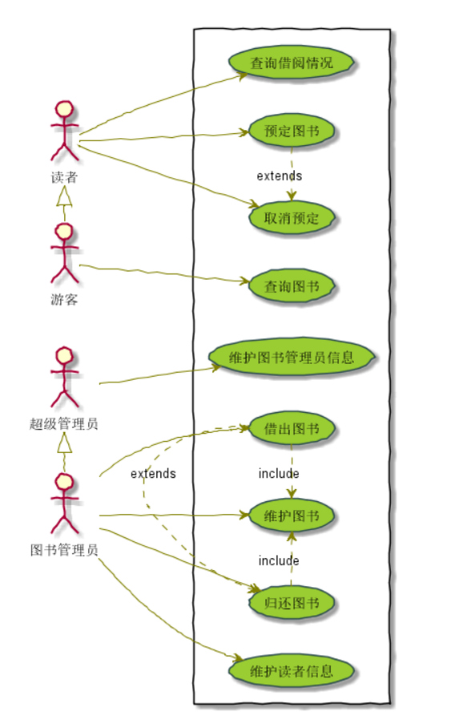
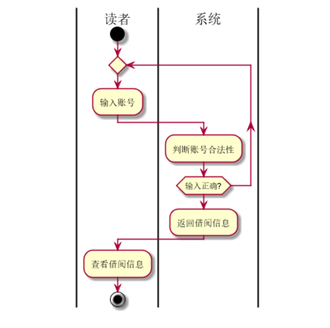
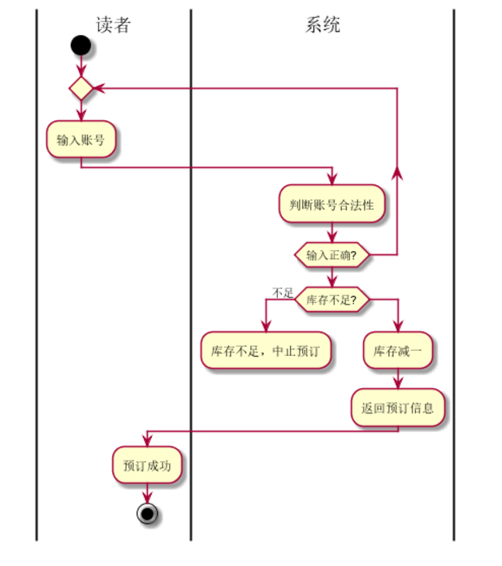
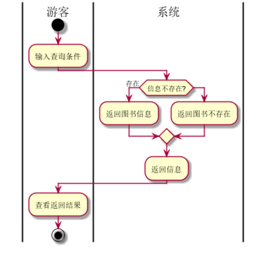
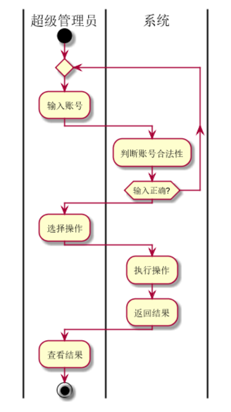
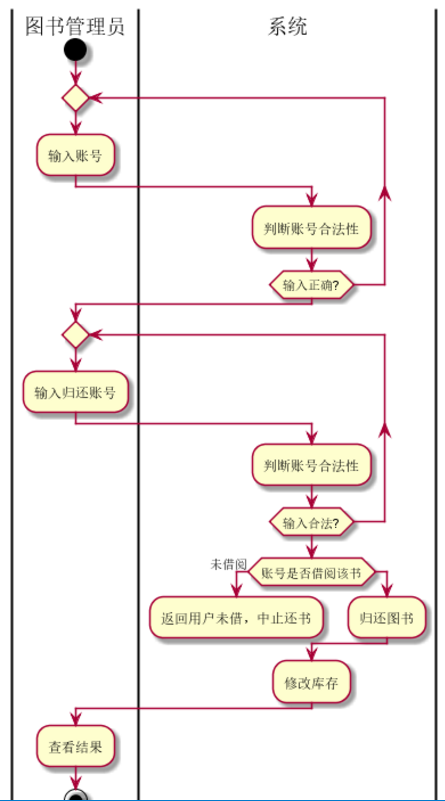
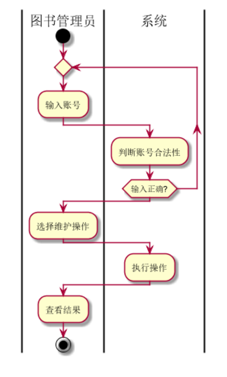

### 1.图书管理系统整体的用例关系图

**1.1PlantUML源码如下：**
~~~
@startuml

skinparam packageStyle rectangle

:超级管理员: as root
:图书管理员: as manage
:游客: as visitor
:读者: as reader

reader <|- visitor
root <|- manage
rectangle  {
	left to right direction
	manage -> (维护图书)
	manage --> (借出图书)
	manage -> (归还图书)
	manage -> (维护读者信息)

	root --> (维护图书管理员信息)

	visitor --> (查询图书)

	reader -> (查询借阅情况)
	reader -> (预定图书)
	reader -> (取消预定)

	(借出图书) .> (归还图书) : extends
	(预定图书) .> (取消预定) : extends
	(借出图书) .> (维护图书) : include
	(归还图书) .> (维护图书) : include

}

skinparam handwritten true
skinparam usecase {
	BackgroundColor YellowGreen
	BorderColor DarkSlateGray
	ArrowColor Olive
	ActorBorderColor black
	ActorFontName Courier

}
@enduml
~~~
**用例流程图如下**

### 2.参与者

**超级管理员**

维护图书管理员的身份信息，并拥有图书管理员所有功能。

**图书管理员：**
维护图书，读者信息，负责图书的借还。

**读者**

查询图书，借阅信息，具有预订和取消预订图书功能。

**游客**

只具有查询图书的功能。

### 3.用例的规约表

**查询借阅信息用例流程图源码如下**
~~~
@startuml
|读者|
start
repeat
:输入账号;
	|系统|
	:判断账号合法性;
repeat while (输入正确?)

:返回借阅信息;
|读者|
:查看借阅信息;

stop
@enduml
~~~

**查询借阅信息用例流程图如下**

**预订图书用例**

**预定图书用例流程图源码如下：**
~~~
@startuml
|读者|
start
repeat
	:输入账号;
	|系统|
	:判断账号合法性;
repeat while (输入正确?)
if(库存不足?) then (不足)
	:库存不足，中止预订;
	detach
else
	:库存减一;
:返回预订信息;
|读者|
:预订成功;

stop
@enduml
~~~

**预订图书用例流程图如下**

**取消预定用例流程图源码如下：**
~~~
@startuml
|读者|
start
repeat
	:输入账号;
	|系统|
	:判断账号合法性;
repeat while (输入正确?)
if(库存不足?) then (不足)
	:库存不足，中止预订;
	detach
else
	:库存减一;
:返回预订信息;
|读者|
:预订成功;

stop
@enduml
~~~

**取消预订用例流程图如下**

**查询图书信息用例流程图源码如下：**
~~~
@startuml
|游客|
start
	:输入查询条件;
	|系统|
if(信息不存在?) then (存在)
	:返回图书信息;
else 
	:返回图书不存在;
endif
:返回信息;
|游客|
:查看返回结果;

stop
@enduml
~~~

**查询图书信息用例流程图如下**

**维护图书管理员信息用例**

**维护图书管理员信息用例流程图源码如下：**
~~~
@startuml
|超级管理员|
start
repeat
	:输入账号;
	|系统|
	:判断账号合法性;
repeat while (输入正确?)
|超级管理员|
:选择操作;
|系统|
:执行操作;
:返回结果;

|超级管理员|
:查看结果;

stop
@enduml
~~~

**维护图书管理员信息用例流程图如下**

**借出图书用例流程图源码如下：**
~~~
@startuml
|图书管理员|
start
repeat
	:输入账号;
	|系统|
	:判断账号合法性;
repeat while (输入正确?)
|图书管理员|
repeat
	:输入借出账号;
	|系统|
	:判断账号合法性;
repeat while (输入合法?)
|系统|
if (库存不足) then (不足)
	:返回库存不足，中止借阅;
	detach
else
	:借出图书;
endif
:修改库存;

|图书管理员|
:查看结果;

stop
@enduml
~~~

**借出图书用例流程图如下**

       

**归还图书用例**

**归还图书用例流程图源码如下：**
~~~
@startuml
|图书管理员|
start
repeat
	:输入账号;
	|系统|
	:判断账号合法性;
repeat while (输入正确?)
|图书管理员|
repeat
	:输入归还账号;
	|系统|
	:判断账号合法性;
repeat while (输入合法?)
|系统|
if (账号是否借阅该书) then (未借阅)
	:返回用户未借，中止还书;
	detach
else
	:归还图书;
endif
:修改库存;

|图书管理员|
:查看结果;

stop
@enduml
~~~

**归还图书用例流程图如下**

    

**维护图书用例流程图源码如下：**
~~~
@startuml
|图书管理员|
start
repeat
	:输入账号;
	|系统|
	:判断账号合法性;
repeat while (输入正确?)
|图书管理员|
:选择维护操作;
|系统|
:执行操作;

|图书管理员|
:查看结果;

stop
@enduml

~~~

**维护图书用例流程图如下**

    

**维护读者信息用例流程图源码如下：**
~~~
@startuml
|图书管理员|
start
repeat
	:输入账号;
	|系统|
	:判断账号合法性;
repeat while (输入正确?)
|图书管理员|
:选择维护操作;
|系统|
:执行操作;

|图书管理员|
:查看结果;

stop
@enduml

~~~

**3.9.3“维护读者信息”用例流程图如下**

    
